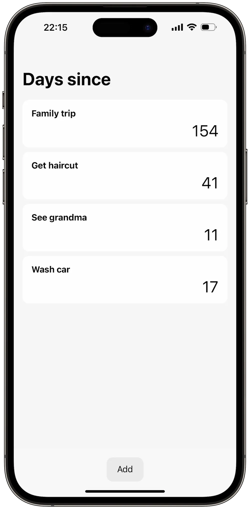

I have always wanted to have an app to track how many days since I last visited someone. The initial concept was to make a personal CRM, but I thought it would be too overkill for what I really wanted to do. Besides, it would require some kind of integration with a contact list provider—like Google—so you don't have to duplicate your contact list, but that would add more complexity to the app.

<!--more-->

Ultimately I decided to create an app that would do just what I wanted: to track days since.

Oma is built on SvelteKit (which was new to me at the time of starting this project) because I wanted to learn something new. I originally had a professional experience with React and a hobby experience with Vue. I considered myself to be quite comfortable with those two front-end frameworks so I wanted to learn a new one.

Oma does not use any CSS library because I wanted to make the app very lightweight. From my design, the project itself does not contain a big variety of components either, so it would be better to code just what the app needs.

Oma stores everything locally in the browser. I don't want to have any authentication mechanism for this simple app. It is also unnecessary to store this kind of data on a server; local storage is enough.

IndexedDB works together with Svelte stores to make this possible. Data is stored persistently in IndexedDB. The app loads data from IndexedDB into Svelte stores when it launches. Subsequent write operations are made to both IndexedDB and Svelte stores but read operations are made only through Svelte stores.

Oma is a progressive web app (PWA) so it can work offline and in full screen like a proper native app if you add it to the home screen.

You can try it out here [https://oma.zartre.com](https://oma.zartre.com/)
